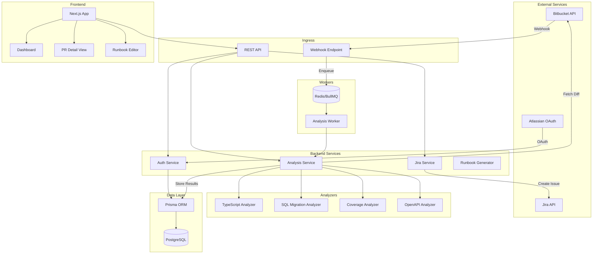

# Design Document: Deployment Risk Analyzer

## Overview

The Deployment Risk Analyzer is a multi-tenant fullstack application that integrates with Bitbucket and Jira to provide automated deployment risk assessment for pull requests. The system receives webhook events from Bitbucket, analyzes code changes using static analysis and AST parsing, calculates risk scores, generates deployment runbooks, and enables Jira issue creation for findings.

The MVP focuses on JavaScript/TypeScript repositories and SQL migrations, with an extensible architecture to support additional languages in the future. The application runs both as an Atlassian Connect app (iframe) and as a standalone web dashboard.

### Key Design Principles

1. **Event-Driven Architecture**: Webhooks trigger asynchronous analysis jobs for scalability
2. **Plugin-Based Analyzers**: Language-specific analyzers implement a common interface for extensibility
3. **Multi-Tenant Isolation**: Organization-scoped data access with encrypted credentials
4. **Testable Components**: Pure functions for analysis logic, dependency injection for external services

## Architecture



### System Flow

1. **Webhook Reception**: Bitbucket sends PR events to `/api/webhooks/bitbucket`
2. **Validation & Queuing**: HMAC signature validated, job enqueued to BullMQ
3. **Analysis Execution**: Worker fetches PR diff, runs analyzers, calculates risk score
4. **Result Storage**: Findings and runbook persisted to PostgreSQL via Prisma
5. **Notification**: Optional Jira issue creation for high-severity findings
6. **UI Display**: Frontend fetches and displays analysis results

## Components and Interfaces

### Backend Components (NestJS)

#### AuthModule
- **AuthController**: Handles OAuth callbacks for Atlassian/Bitbucket/Jira
- **AuthService**: Token exchange, refresh, encryption/decryption
- **AuthGuard**: JWT validation and organization context injection
- **RbacGuard**: Role-based access control enforcement

#### WebhookModule
- **WebhookController**: Receives Bitbucket webhook payloads
- **WebhookService**: HMAC validation, event parsing, job enqueueing
- **HmacValidator**: Validates webhook signatures

#### AnalysisModule
- **AnalysisController**: Manual analysis triggers, result retrieval
- **AnalysisService**: Orchestrates analysis pipeline
- **AnalysisWorker**: BullMQ processor for analysis jobs

#### AnalyzersModule (Plugin Architecture)
```typescript
interface Analyzer {
  name: string;
  supportedExtensions: string[];
  analyze(context: AnalysisContext): Promise<Finding[]>;
}

interface AnalysisContext {
  files: FileChange[];
  diff: string;
  repoConfig: RepoConfig;
}

interface FileChange {
  path: string;
  oldContent: string | null;
  newContent: string | null;
  hunks: DiffHunk[];
}
```

- **TypeScriptAnalyzer**: AST-based detection of exported function signature changes
- **SqlMigrationAnalyzer**: Parses SQL for destructive operations
- **CoverageAnalyzer**: Parses lcov reports, maps to changed files
- **OpenApiAnalyzer**: Diffs OpenAPI specs for breaking changes
- **PermissionAnalyzer**: Pattern matching for ACL code changes

#### JiraModule
- **JiraController**: Issue creation, status fetching
- **JiraService**: Jira API client with OAuth token management

#### RunbookModule
- **RunbookService**: Template-based runbook generation
- **RunbookController**: Runbook retrieval and updates

### Frontend Components (Next.js)

#### Pages
- `/dashboard`: Organization overview, recent analyses list
- `/repos/[repoId]/pr/[prId]`: PR analysis detail view
- `/settings`: Organization settings, integrations, thresholds
- `/onboarding`: OAuth connection flow

#### Components
- **AnalysisList**: Paginated list with risk level badges
- **FindingsPanel**: Grouped findings with expandable details
- **RunbookEditor**: Markdown editor with live preview
- **RiskBadge**: Color-coded severity indicator
- **JiraIssueButton**: Create/link Jira issue from finding

### Shared Libraries (`/libs`)

#### @dra/types
- Shared TypeScript interfaces for API contracts
- Prisma-generated types re-exported

#### @dra/analyzers
- Analyzer interface and base implementations
- AST utilities for TypeScript parsing
- SQL parser utilities

#### @dra/scoring
- Risk score calculation logic
- Severity classification functions

## Data Models

```prisma
model Organization {
  id        String   @id @default(cuid())
  name      String
  settings  Json     @default("{}")
  createdAt DateTime @default(now())
  updatedAt DateTime @updatedAt
  
  users        User[]
  integrations Integration[]
  repos        Repo[]
}

model User {
  id        String   @id @default(cuid())
  orgId     String
  email     String
  name      String
  role      Role     @default(DEVELOPER)
  createdAt DateTime @default(now())
  
  org      Organization @relation(fields: [orgId], references: [id])
  runbooks Runbook[]
  
  @@unique([orgId, email])
}

enum Role {
  ADMIN
  DEVELOPER
}

model Integration {
  id           String          @id @default(cuid())
  orgId        String
  type         IntegrationType
  accessToken  String          // Encrypted
  refreshToken String?         // Encrypted
  expiresAt    DateTime?
  metadata     Json            @default("{}")
  createdAt    DateTime        @default(now())
  updatedAt    DateTime        @updatedAt
  
  org Organization @relation(fields: [orgId], references: [id])
  
  @@unique([orgId, type])
}

enum IntegrationType {
  BITBUCKET
  JIRA
}

model Repo {
  id             String   @id @default(cuid())
  orgId          String
  providerRepoId String
  name           String
  fullName       String
  defaultBranch  String   @default("main")
  settings       Json     @default("{}")
  createdAt      DateTime @default(now())
  
  org          Organization  @relation(fields: [orgId], references: [id])
  pullRequests PullRequest[]
  
  @@unique([orgId, providerRepoId])
}

model PullRequest {
  id           String   @id @default(cuid())
  repoId       String
  providerPrId Int
  title        String
  author       String
  sourceBranch String
  targetBranch String
  status       PrStatus @default(OPEN)
  createdAt    DateTime @default(now())
  updatedAt    DateTime @updatedAt
  
  repo         Repo          @relation(fields: [repoId], references: [id])
  analysisRuns AnalysisRun[]
  
  @@unique([repoId, providerPrId])
}

enum PrStatus {
  OPEN
  MERGED
  DECLINED
}

model AnalysisRun {
  id           String         @id @default(cuid())
  prId         String
  status       AnalysisStatus @default(PENDING)
  riskScore    Int?
  riskLevel    RiskLevel?
  startedAt    DateTime?
  finishedAt   DateTime?
  errorMessage String?
  metadata     Json           @default("{}")
  createdAt    DateTime       @default(now())
  
  pr       PullRequest @relation(fields: [prId], references: [id])
  findings Finding[]
  runbook  Runbook?
}

enum AnalysisStatus {
  PENDING
  IN_PROGRESS
  COMPLETED
  FAILED
}

enum RiskLevel {
  LOW
  MEDIUM
  HIGH
  CRITICAL
}

model Finding {
  id            String        @id @default(cuid())
  analysisRunId String
  type          FindingType
  severity      Severity
  title         String
  description   String
  filePath      String?
  lineStart     Int?
  lineEnd       Int?
  codeSnippet   String?
  remediation   String?
  metadata      Json          @default("{}")
  jiraIssueKey  String?
  createdAt     DateTime      @default(now())
  
  analysisRun AnalysisRun @relation(fields: [analysisRunId], references: [id])
}

enum FindingType {
  BREAKING_API
  DESTRUCTIVE_MIGRATION
  PERMISSION_CHANGE
  LOW_COVERAGE
  UNDOCUMENTED_API
}

enum Severity {
  LOW
  MEDIUM
  HIGH
  CRITICAL
}

model Runbook {
  id            String   @id @default(cuid())
  analysisRunId String   @unique
  content       String   // Markdown
  authorId      String?
  createdAt     DateTime @default(now())
  updatedAt     DateTime @updatedAt
  
  analysisRun AnalysisRun @relation(fields: [analysisRunId], references: [id])
  author      User?       @relation(fields: [authorId], references: [id])
}

model AuditLog {
  id        String   @id @default(cuid())
  orgId     String
  userId    String?
  action    String
  resource  String
  resourceId String?
  metadata  Json     @default("{}")
  createdAt DateTime @default(now())
}
```

## Error Handling

### API Error Responses
All API errors follow a consistent format:
```typescript
interface ApiError {
  statusCode: number;
  error: string;
  message: string;
  correlationId: string;
}
```

### Error Categories

| Category | HTTP Status | Handling |
|----------|-------------|----------|
| Validation Error | 400 | Return field-level errors |
| Authentication Error | 401 | Redirect to login |
| Authorization Error | 403 | Return permission denied |
| Not Found | 404 | Return resource not found |
| Rate Limited | 429 | Return retry-after header |
| External Service Error | 502 | Retry with backoff, log error |
| Internal Error | 500 | Log full stack, return generic message |

### Analysis Pipeline Error Handling
- **Bitbucket API Failure**: Retry 3 times with exponential backoff (1s, 2s, 4s)
- **Parser Error**: Log error, skip file, continue analysis with partial results
- **Timeout**: 5-minute max analysis time, fail job if exceeded
- **Queue Failure**: Dead letter queue for failed jobs after 3 retries

### Webhook Error Handling
- **Invalid Signature**: Return 401, log attempt with IP
- **Malformed Payload**: Return 400, log payload hash
- **Processing Error**: Return 202 (accepted), handle async

## Testing Strategy

### Testing Framework
- **Unit Tests**: Jest with ts-jest
- **Property-Based Tests**: fast-check library
- **Integration Tests**: Jest with supertest for API testing
- **E2E Tests**: Playwright for frontend flows

### Dual Testing Approach

Unit tests and property-based tests serve complementary purposes:
- **Unit tests** verify specific examples, edge cases, and integration points
- **Property-based tests** verify universal properties that hold across all inputs

### Unit Testing Guidelines
- Test each analyzer with fixture diffs representing real-world scenarios
- Test risk scoring with known input/output pairs
- Test API endpoints with mocked services
- Test HMAC validation with valid and invalid signatures
- Minimum 80% code coverage target

### Property-Based Testing Guidelines
- Use fast-check for generating random test inputs
- Configure minimum 100 iterations per property test
- Tag each property test with the correctness property it validates
- Focus on:
  - Round-trip properties for parsers/serializers
  - Invariants for data transformations
  - Idempotence for retry-safe operations

### Test Organization
```
/apps/backend/src
  /modules
    /analysis
      analysis.service.ts
      analysis.service.spec.ts        # Unit tests
      analysis.service.property.spec.ts  # Property tests
    /analyzers
      typescript.analyzer.ts
      typescript.analyzer.spec.ts
      typescript.analyzer.property.spec.ts
```


## Correctness Properties

*A property is a characteristic or behavior that should hold true across all valid executions of a system-essentially, a formal statement about what the system should do. Properties serve as the bridge between human-readable specifications and machine-verifiable correctness guarantees.*

### Round-Trip Properties

Property 1: TypeScript AST Round-Trip
*For any* valid JavaScript or TypeScript source code, parsing it into an AST and printing it back should produce semantically equivalent source code (whitespace-normalized comparison).
**Validates: Requirements 2.7**

Property 2: Coverage Data Serialization Round-Trip
*For any* valid coverage data structure containing line, branch, and function coverage metrics, serializing to JSON and deserializing should produce an equivalent data structure.
**Validates: Requirements 3.5**

Property 3: Risk Score Serialization Round-Trip
*For any* risk score calculation result containing score breakdown by finding type, serializing to JSON and deserializing should produce an equivalent score breakdown.
**Validates: Requirements 4.6**

Property 4: Runbook Markdown Round-Trip
*For any* generated runbook containing pre-deploy, deploy, post-deploy, and rollback sections, parsing the markdown structure and re-serializing should preserve all sections and their content.
**Validates: Requirements 5.6**

Property 5: Job Payload Serialization Round-Trip
*For any* analysis job payload containing PR ID, repo ID, and webhook metadata, serializing to JSON for queue storage and deserializing should produce an equivalent job payload.
**Validates: Requirements 9.5**

Property 6: OpenAPI Specification Round-Trip
*For any* valid OpenAPI 3.x specification, parsing and re-serializing to YAML/JSON should produce a semantically equivalent specification.
**Validates: Requirements 10.4**

Property 7: Analyzer Configuration Round-Trip
*For any* analyzer configuration containing language settings, thresholds, and ignore patterns, serializing to JSON and deserializing should produce an equivalent configuration.
**Validates: Requirements 12.4**

Property 8: Token Encryption Round-Trip
*For any* OAuth token string, encrypting with KMS and decrypting should produce the original token string.
**Validates: Requirements 8.5**

### Detection Properties

Property 9: Exported Function Signature Change Detection
*For any* TypeScript/JavaScript diff where an exported function's parameter types, return type, or parameter count changes, the TypeScript analyzer should produce a Finding of type BREAKING_API.
**Validates: Requirements 2.2**

Property 10: Migration Path Pattern Matching
*For any* file path, if the path matches `migrations/*` or `db/migrate/*` pattern, the SQL analyzer should be invoked for that file.
**Validates: Requirements 2.3**

Property 11: Destructive SQL Operation Detection
*For any* SQL content containing DROP TABLE, DROP COLUMN, or ALTER TYPE statements, the SQL analyzer should produce a Finding with severity HIGH or CRITICAL.
**Validates: Requirements 2.4**

Property 12: Permission Pattern Detection
*For any* code diff containing patterns like `hasPermission`, `isAdmin`, `role ===`, or `req.user.roles`, the permission analyzer should produce a Finding of type PERMISSION_CHANGE.
**Validates: Requirements 2.5**

Property 13: OpenAPI Breaking Change Detection
*For any* pair of OpenAPI specifications where endpoints are removed or required parameters are added, the OpenAPI analyzer should produce a Finding with severity HIGH.
**Validates: Requirements 10.1, 10.3**

Property 14: Undocumented API Change Detection
*For any* PR diff where route handler files are modified but no OpenAPI specification file is changed, the analyzer should produce a Finding of type UNDOCUMENTED_API.
**Validates: Requirements 10.2**

### Scoring Properties

Property 15: Risk Score Calculation
*For any* set of findings, the risk score should equal the sum of: (count of BREAKING_API × 40) + (count of DESTRUCTIVE_MIGRATION × 50) + (count of PERMISSION_CHANGE × 30) + (count of LOW_COVERAGE × 20) + (count of UNDOCUMENTED_API × 10).
**Validates: Requirements 4.1**

Property 16: Risk Severity Classification
*For any* risk score value, the severity classification should be: CRITICAL if score ≥ 80, HIGH if 60 ≤ score < 80, MEDIUM if 35 ≤ score < 60, LOW if score < 35.
**Validates: Requirements 4.2, 4.3, 4.4, 4.5**

### Coverage Properties

Property 17: LCOV Parsing Completeness
*For any* valid lcov format coverage report, parsing should extract line coverage percentage, branch coverage percentage, and function coverage percentage for each file entry.
**Validates: Requirements 3.1, 3.4**

Property 18: Coverage Threshold Detection
*For any* modified file with coverage percentage below the configured threshold, the coverage analyzer should produce a Finding of type LOW_COVERAGE with severity MEDIUM.
**Validates: Requirements 3.2**

### Runbook Properties

Property 19: Runbook Required Sections
*For any* completed analysis, the generated runbook should contain non-empty sections for: pre-deploy checks, deploy steps, post-deploy verification, and rollback plan.
**Validates: Requirements 5.1**

Property 20: Runbook Migration Commands
*For any* analysis containing DESTRUCTIVE_MIGRATION findings, the generated runbook should include migration up commands, migration down commands, and data loss warnings in the rollback section.
**Validates: Requirements 5.2, 5.4**

### Security Properties

Property 21: HMAC Signature Validation
*For any* webhook payload and secret, computing HMAC-SHA256 and comparing with the provided signature should accept valid signatures and reject invalid signatures with HTTP 401.
**Validates: Requirements 11.2**

Property 22: XSS Sanitization
*For any* user-generated content string containing HTML tags or JavaScript, sanitization should remove or escape all potentially dangerous elements while preserving safe text content.
**Validates: Requirements 11.3**

Property 23: Audit Log Creation
*For any* runbook modification or approval action, an audit log entry should be created containing the user ID, action type, resource ID, and timestamp.
**Validates: Requirements 11.5**

### Multi-Tenancy Properties

Property 24: Organization Data Isolation
*For any* data query (repositories, analyses, integrations) executed in the context of a user, the results should only include records belonging to that user's organization.
**Validates: Requirements 8.2**

Property 25: Role-Based Access Control
*For any* user with ADMIN role, settings modification endpoints should be accessible; for any user with DEVELOPER role, settings modification endpoints should return HTTP 403.
**Validates: Requirements 8.3, 8.4**

Property 26: Idempotent User Creation
*For any* Atlassian OAuth authentication with the same user identifier, repeated authentications should return the same User record without creating duplicates.
**Validates: Requirements 8.1**

### Pipeline Properties

Property 27: Analysis Status State Machine
*For any* analysis job, the status should transition from PENDING → IN_PROGRESS (on pickup) → COMPLETED (on success) or FAILED (on error), and each transition should record the appropriate timestamp.
**Validates: Requirements 9.2, 9.3**

Property 28: Unsupported File Graceful Handling
*For any* repository containing files with unsupported language extensions, analysis should complete successfully, skipping those files and including only findings from supported files.
**Validates: Requirements 12.2**

### Integration Properties

Property 29: Auto-Create Jira for Critical Findings
*For any* analysis with findings of severity HIGH or CRITICAL where auto-create is enabled in organization settings, Jira issues should be created for each such finding.
**Validates: Requirements 6.5**
